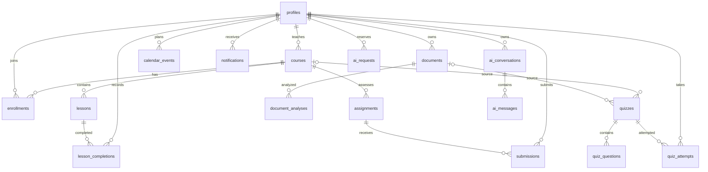

# Entity relationships

```mermaid
erDiagram
  profiles ||--o{ courses : teaches
  profiles ||--o{ enrollments : joins
  courses ||--o{ enrollments : has
  courses ||--o{ lessons : contains
  lessons ||--o{ lesson_completions : completed
  profiles ||--o{ lesson_completions : records
  courses ||--o{ assignments : assesses
  assignments ||--o{ submissions : receives
  profiles ||--o{ submissions : submits
  profiles ||--o{ documents : owns
  documents ||--o{ document_analyses : analyzed
  documents o|--o{ quizzes : source
  courses o|--o{ quizzes : source
  quizzes ||--o{ quiz_questions : contains
  quizzes ||--o{ quiz_attempts : attempted
  profiles ||--o{ quiz_attempts : takes
  profiles ||--o{ calendar_events : plans
  profiles ||--o{ notifications : receives
  profiles ||--o{ ai_conversations : owns
  ai_conversations ||--o{ ai_messages : contains
  profiles ||--o{ ai_requests : reserves
```
